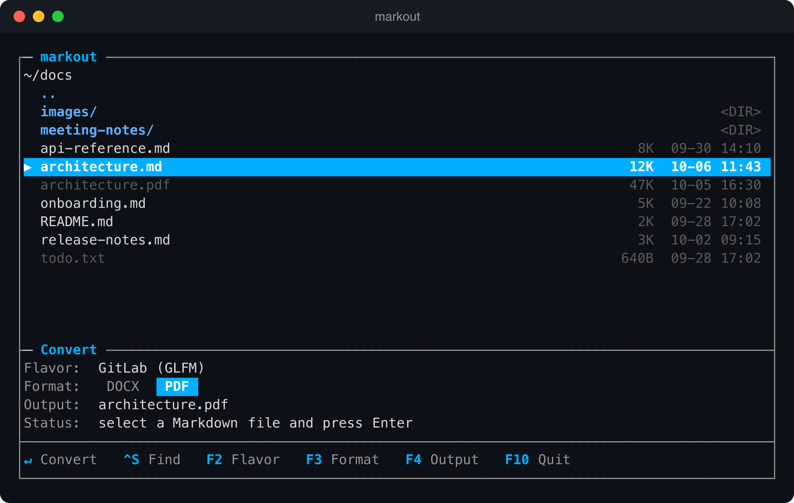
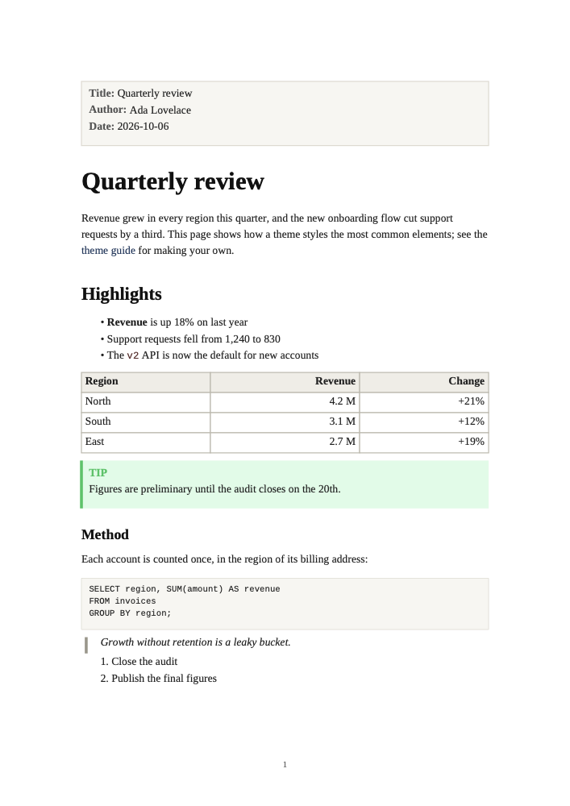
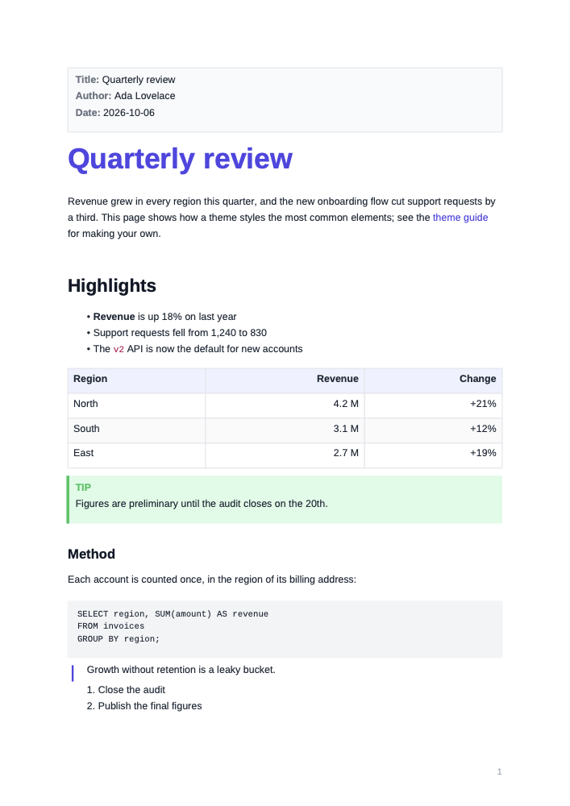
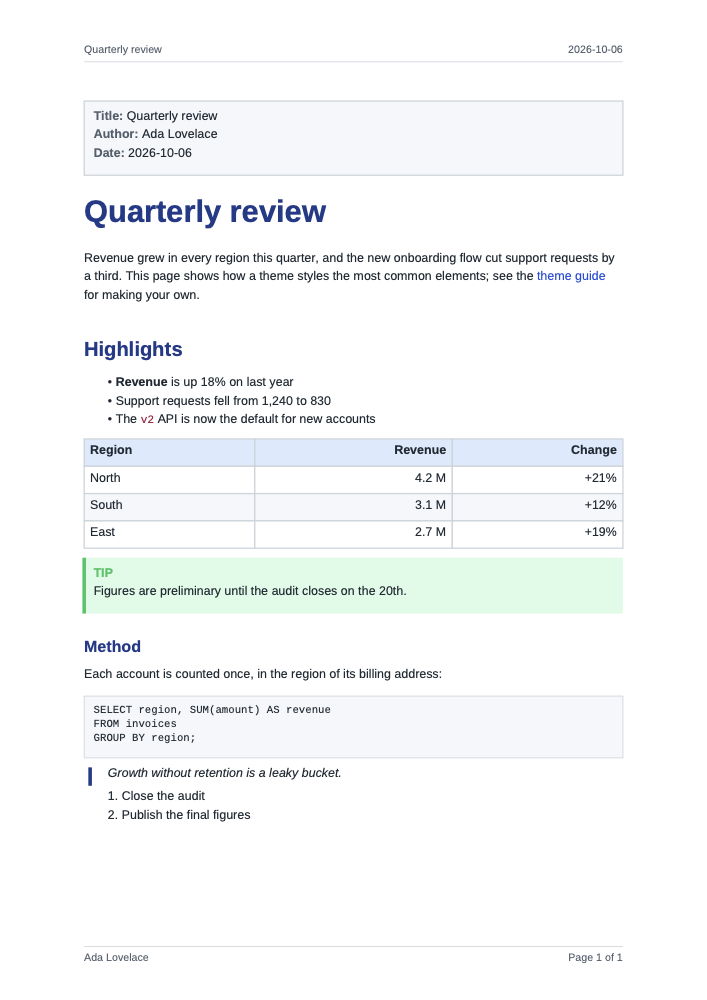
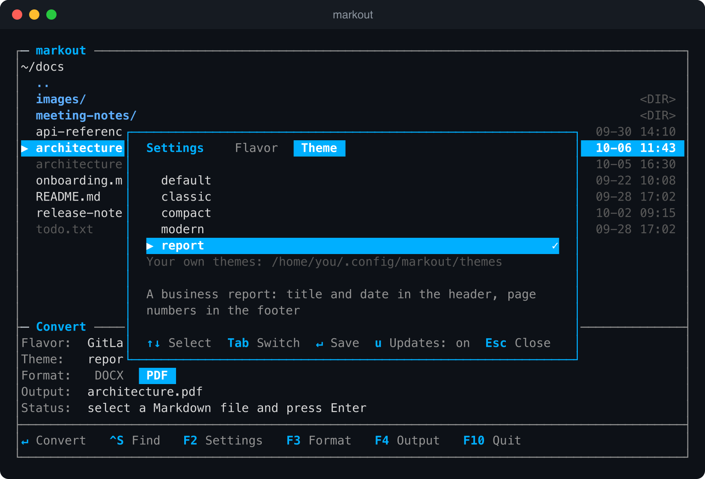
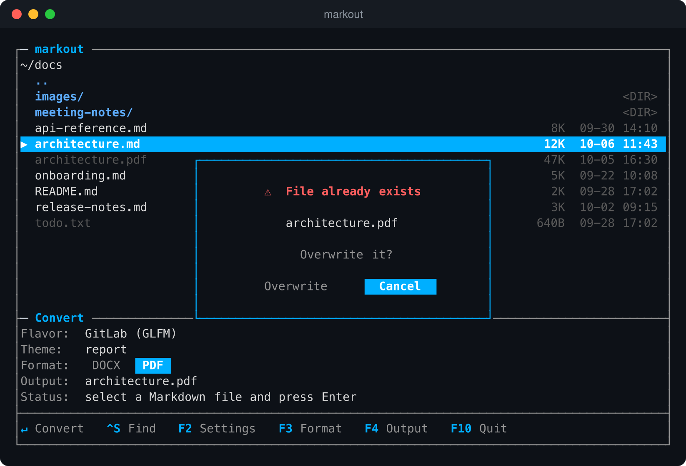
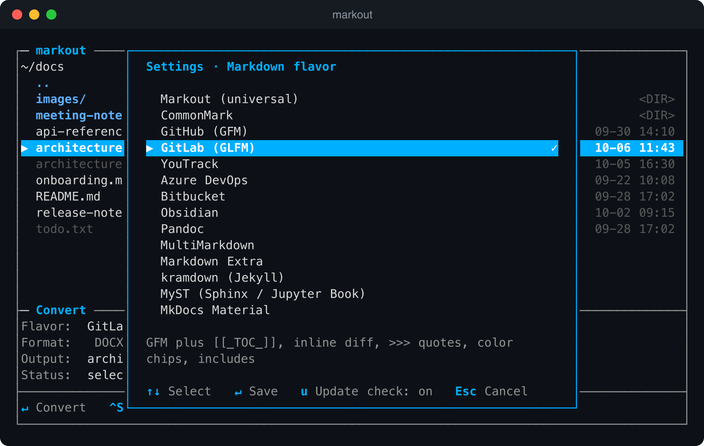

# markout

[](https://github.com/hkmt-sw/markout/actions/workflows/ci.yml)
[](https://github.com/hkmt-sw/markout/actions/workflows/release.yml)
[](https://github.com/hkmt-sw/markout/releases/latest)
[](go.mod)
[](LICENSE)

A fast Markdown → **DOCX / PDF** converter with an interactive terminal UI (TUI).

No browser, no webview, no GUI toolkit — it runs entirely in your terminal, as
a single binary with the fonts built in.

It reads Markdown the way the platform you wrote it for does: pick GitHub,
GitLab, YouTrack, Azure DevOps, Obsidian, Pandoc or one of the
[other flavors](#markdown-flavors), and that dialect's alerts, task lists,
footnotes, tables of contents and the rest are understood. Math and Mermaid
diagrams are recognized but shown as their source, not drawn; see
[Limits](#limits).



## Install

### From a release binary (no Go required)

Grab the binary for your platform from the
[latest release](https://github.com/hkmt-sw/markout/releases/latest), or with
`curl` (example for macOS Apple Silicon):

```sh
# Look up the latest release tag (or set VERSION=v1.3.3 to pin one).
VERSION=$(curl -fsSL https://api.github.com/repos/hkmt-sw/markout/releases/latest \
  | sed -n 's/.*"tag_name": *"\([^"]*\)".*/\1/p')
curl -fsSL -o markout \
  "https://github.com/hkmt-sw/markout/releases/download/$VERSION/markout_${VERSION}_darwin_arm64"
chmod +x markout
mv markout /usr/local/bin/        # or any directory on your $PATH, e.g. ~/.local/bin
```

Pick the asset that matches your system:

| OS / CPU | Asset |
| --- | --- |
| macOS Apple Silicon | `markout_<VERSION>_darwin_arm64` |
| macOS Intel | `markout_<VERSION>_darwin_amd64` |
| Linux x86-64 | `markout_<VERSION>_linux_amd64` |
| Linux arm64 | `markout_<VERSION>_linux_arm64` |
| Windows x86-64 | `markout_<VERSION>_windows_amd64.exe` |
| Windows arm64 | `markout_<VERSION>_windows_arm64.exe` |

On macOS the binary is unsigned, so Gatekeeper may block the first run. Clear the
quarantine flag once:

```sh
xattr -d com.apple.quarantine /usr/local/bin/markout
```

Optionally verify the download against the release's `SHA256SUMS.txt`, or
check with the [GitHub CLI](https://cli.github.com) that it was built by this
repository's release workflow (releases from v1.1.2 on):

```sh
shasum -a 256 -c SHA256SUMS.txt    # (Linux: sha256sum -c)
gh attestation verify markout --repo hkmt-sw/markout
```

### With Go

```sh
go install github.com/hkmt-sw/markout@latest
```

### From source

```sh
git clone https://github.com/hkmt-sw/markout.git
cd markout
go build -o markout .   # produces ./markout
make install            # or install to $GOBIN (~/go/bin): go install .
```

If the install dir isn't on your `PATH`, add it to your shell profile:

```sh
export PATH="$(go env GOPATH)/bin:$PATH"
```

Other Makefile targets: `make run` (launch without installing), `make test`,
`make release` (cross-compile all platforms into `dist/`), `make uninstall`,
`make clean`.

## Usage

### Interactive TUI

Run with no arguments to launch the full-screen UI:

```sh
./markout
```

It's a single Midnight-Commander-style window: a file list on top, a docked
**Convert** box below (flavor / theme / format / output / status), and a function-key
bar at the bottom. Highlight a Markdown file and press Enter to convert it.

| Key            | Action                                         |
| -------------- | ---------------------------------------------- |
| `↑ ↓`          | Move through the file list                     |
| `→` / `Enter`  | Enter a directory                              |
| `←`            | Go up a directory                              |
| `Enter`        | Convert the highlighted `.md` file             |
| `F2`           | Settings: Markdown flavor, theme, update check |
| `F3`           | Toggle output format (DOCX ⇄ PDF)              |
| `F4`           | Edit the output path by hand                   |
| `o`            | Open the last converted file                   |
| `F10` / `q`    | Quit                                           |

The output path is derived automatically from the highlighted file and the
selected format (**PDF by default**); `F4` lets you override it. If the output
file already exists, a popup asks you to confirm before overwriting it.

### Direct (non-interactive)

The output format is inferred from the file extension:

```sh
./markout input.md output.docx
./markout input.md output.pdf
./markout --flavor gitlab input.md output.pdf   # interpret as a specific flavor
./markout --list-flavors                        # show the supported flavors
./markout --remote-images allow input.md out.pdf # download images referenced by URL
```

## Themes

A theme decides how the output looks: page size and margins, fonts, sizes,
spacing, colors, and headers and footers. Five come built in:

| `--theme` | Look |
| --- | --- |
| `default` | The standard markout look |
| `classic` | Serif type, wide margins, restrained color: like a book or a paper |
| `modern` | Sans-serif and airy, with one vivid accent color |
| `compact` | Small type and narrow margins: long technical documents on fewer pages |
| `report` | A business report: title and date in the header, page numbers in the footer |

| classic | modern | report |
| --- | --- | --- |
|  |  |  |

Pick one on the **Theme** tab of the settings (`F2`, then `Tab`), or per
conversion:

```sh
./markout --theme report input.md output.pdf
./markout --list-themes
```



**Your own theme** is a small text file that lists what it changes:

```toml
extends = "default"

[fonts]
body = "serif"

[heading]
color = "#7A1E1E"

[footer]
center = "Page {page} of {pages}"
```

```sh
./markout --export-theme > mytheme.toml     # every setting, to start from
./markout --theme mytheme.toml input.md output.pdf
```

The [theme guide](docs/themes.md) walks through making one, with every
setting, your own fonts, and headers and footers. To check a theme, convert
[`fixtures/showcase.md`](fixtures/showcase.md): it contains every element
with a note on what it should look like.

## Update notifications

When a newer release exists, the TUI says so in its top border:

```
┌─ markout ──────────── v1.3.0 is available · github.com/hkmt-sw/markout/releases ──┐
```

It only tells you; installing the new version is up to you (download the
binary again, or `go install github.com/hkmt-sw/markout@latest`).

To know, the TUI asks GitHub for the latest release when it starts, at most
once a day. That request carries nothing but the markout version, though
GitHub sees your IP address like any web server does. It is the one request
markout makes without asking first, so you can turn it off: press `F2`, then
`u`. Direct conversions from the command line never check. To look on demand:

```sh
./markout --check-update
```

## Images from the internet

A document can reference images by URL. Downloading them tells the servers it
names your IP address and that you opened the document, and a document from
someone else can point at addresses on your own machine or local network. So
markout never downloads an image without asking.



- **In the TUI**, converting such a document first shows every server it would
  contact and how many images are on each; addresses on your machine or local
  network are marked. Choose **Load images**, **Skip images** (the default:
  the conversion runs and those images become placeholders) or **Cancel**.
- **On the command line**, the same list is printed and you are asked `[y/N]`.
  When there is nobody to ask (a script, a pipe, CI) the images are skipped
  and listed on standard error. `--remote-images allow` downloads without
  asking, `--remote-images deny` always skips.

The answer is not remembered: the question comes up for each conversion that
needs it. Images stored on disk next to the document are not affected.

## Markdown flavors

"Markdown" is a family of dialects: the same file renders differently on
GitHub, GitLab, YouTrack or in Obsidian. markout has an interpreter for each of
the flavors below, so a document converts the way it looks on the platform it
was written for.



Pick the flavor with `F2` in the TUI. The choice is saved (in
`markout/config.json` under your OS config directory, or the file named by
`$MARKOUT_CONFIG`) and is also the default for direct conversions; `--flavor`
overrides it for one run.

| `--flavor`      | Flavor | What it adds to CommonMark |
| --------------- | ------ | -------------------------- |
| `markout`       | Markout (universal, default) | Every extension below that doesn't conflict with another; a good fit when you don't know where a file came from |
| `commonmark`    | CommonMark | Nothing: the strict standard |
| `github`        | GitHub (GFM) | Tables, task lists, strikethrough, autolinks, footnotes, `> [!NOTE]` alerts, `$math$`, Mermaid, `:emoji:`, color chips |
| `gitlab`        | GitLab (GLFM) | GFM plus `[[_TOC_]]`, alert titles, `{+ inline +}` `{- diff -}`, `>>>` quotes, `[~]` tasks, JSON/TOML front matter, `json:table`, `::include{file=…}`, `{width=…}` images, definition lists |
| `youtrack`      | YouTrack | Tables, checklists, strikethrough, autolinks, ` ```latex ` formulas, Mermaid, `{width=…}` images |
| `azure`         | Azure DevOps | GFM plus `[[_TOC_]]`, `::: mermaid`, `$math$`, `` sizes, `:emoji:` |
| `bitbucket`     | Bitbucket | Tables, strikethrough, footnotes, definition lists, `[TOC]`, `[[wiki links]]`; raw HTML is shown as text |
| `obsidian`      | Obsidian | `[[wiki links]]`, `![[image.png\|300]]` embeds, `==highlight==`, callouts of any type (foldable, titled), `%%comments%%`, `^[inline notes]`, `$math$` |
| `pandoc`        | Pandoc (also Quarto, R Markdown) | `% title` block, `:::` fenced divs, `^super^` and `~sub~`script, inline notes, `[span]{.underline}`, heading attributes, smart punctuation |
| `multimarkdown` | MultiMarkdown | Metadata header, `{{TOC}}`, CriticMarkup, `\\(math\\)`, `^super^` and `~sub~`script |
| `extra`         | Markdown Extra | Tables, footnotes, definition lists, abbreviations, heading IDs |
| `kramdown`      | kramdown (Jekyll) | Markdown Extra plus `{:toc}`, `{: .class}` attribute lists, `$$math$$`, smart punctuation |
| `myst`          | MyST (Sphinx, Jupyter Book) | ` ```{directive} ` and `:::{directive}` blocks, ``{role}`text` ``, `$math$` |
| `mkdocs`        | MkDocs Material | `!!! note` admonitions, `=== "Tab"` tabs, `[TOC]`, `==mark==`, `^^insert^^`, `^super^`, `~sub~`, CriticMarkup |
| `docusaurus`    | Docusaurus (MDX) | `:::note` admonitions, `{#heading-ids}`; MDX imports, exports and comments are dropped |

Text written by AI assistants is GitHub-style Markdown, often with math in
LaTeX delimiters; the default flavor reads both `$…$` and `\(…\)` / `\[…\]`.

Syntax that a flavor doesn't define is left as plain text, exactly as that
platform would show it (`~~text~~` stays literal under CommonMark, for example).

Things that only make sense on the original platform have no document
equivalent and stay as text: `@mentions`, issue references such as `#123` or
`ABC-123`, and links to other wiki pages.

## Limits

markout lays the document out itself, with no browser or TeX behind it. Some
things are beyond it for now:

- **Math** is shown as its LaTeX source, in color; it is not typeset.
- **Mermaid diagrams** are shown as their source in a labeled box; they are
  not drawn.
- **Code** is not syntax-highlighted.
- **Blocks inside a list item** other than text and nested lists (a code
  block, a quote, a table) are left out, in both formats.
- **Characters the PDF fonts lack.** The built-in fonts cover Latin, Greek and
  Cyrillic. Other characters (Chinese, Japanese, Korean, Arabic, emoji) are
  left out of a PDF, and the conversion says which ones: as a warning on
  standard error for a direct conversion, in the status line in the TUI. A
  theme can use [a font of your own](docs/themes.md#fonts) that has them.
  DOCX keeps every character and leaves the choice of font to the word
  processor.
- **Right-to-left text** (Hebrew, Arabic) is not laid out in PDF: its letters
  come out in reverse order. The conversion warns about this too.
- **Links to a heading** of the same document (`[text](#heading)`) do not
  jump there in PDF, and a PDF has no bookmarks.
- **DOCX is formatted directly.** Headings and lists look right but are not
  Word's heading styles or automatic lists, and a table of contents is plain
  text, so the navigation pane and "update table" have nothing to work with.

## Project layout

| Path               | Purpose                                         |
| ------------------ | ----------------------------------------------- |
| `main.go`          | Entry point (TUI + direct CLI mode)             |
| `internal/tui`     | Bubble Tea terminal UI                          |
| `internal/flavor`  | The supported Markdown flavors and their features |
| `internal/parse`   | Markdown → AST (goldmark), per-flavor syntax     |
| `internal/render`  | AST → DOCX / PDF renderers                       |
| `internal/convert` | Conversion orchestration                        |
| `internal/theme`   | Themes: the built-in ones and theme files       |
| `internal/settings`| Saved preferences (the selected flavor)         |
| `fixtures`         | Sample documents: `showcase.md` shows every element, `flavors/` has one per flavor |
| `docs`             | The [theme guide](docs/themes.md) and pictures  |
| `cmd/debug`        | Dumps the parsed AST as JSON for debugging       |

## Contributing

Bug reports and pull requests are welcome; see [CONTRIBUTING.md](CONTRIBUTING.md).
Changes between versions are listed in [CHANGELOG.md](CHANGELOG.md), and
security problems are reported as described in [SECURITY.md](SECURITY.md).

## License

Copyright © 2026 Márton Tamás

markout is free software: you can redistribute it and/or modify it under the
terms of the [GNU General Public License, version 3](LICENSE). It is
distributed in the hope that it will be useful, but without any warranty.

It builds on these projects:

- [goldmark](https://github.com/yuin/goldmark) and its extensions (Markdown parsing; MIT, BSD-3-Clause)
- [docxgo](https://github.com/mmonterroca/docxgo) (DOCX output; MIT)
- [gopdf](https://github.com/signintech/gopdf) (PDF output; MIT)
- [resvg-go](https://github.com/kanrichan/resvg-go) (SVG rendering; GPL-3.0)
- [Bubble Tea](https://github.com/charmbracelet/bubbletea) (terminal UI; MIT)
- The [Liberation fonts](https://github.com/liberationfonts/liberation-fonts),
  embedded for PDF output under the
  [SIL Open Font License](internal/render/fonts/LICENSE)
