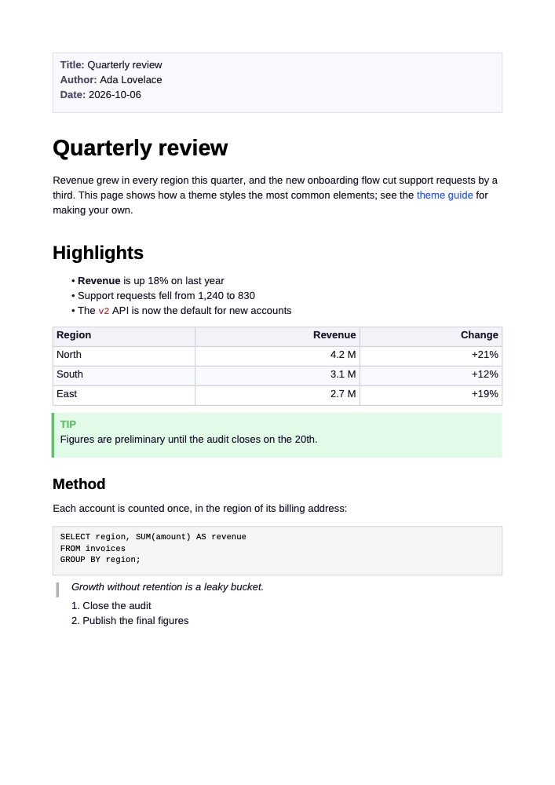
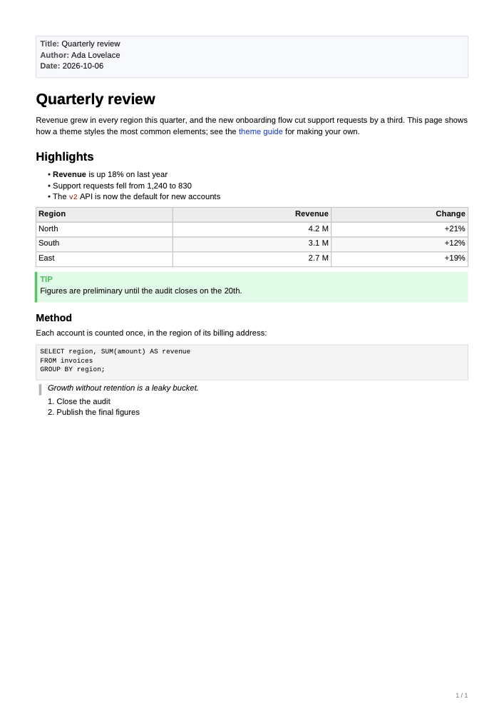

# Themes

A theme decides how a converted document looks: the paper and its margins,
the fonts, the sizes and spacing of every element, the colors, and whether
pages carry a header and a footer. The same theme styles both PDF and DOCX.

- [Built-in themes](#built-in-themes)
- [Using a theme](#using-a-theme)
- [Your first theme](#your-first-theme)
- [How a theme file works](#how-a-theme-file-works)
- [Fonts](#fonts)
- [Headers and footers](#headers-and-footers)
- [Settings reference](#settings-reference)
- [When something goes wrong](#when-something-goes-wrong)

## Built-in themes

Five themes come with markout. Each picture is the first page of
[`themes/sample.md`](themes/sample.md) as PDF.

| | |
| --- | --- |
| **default**: the standard markout look | **classic**: serif type, wide margins, restrained color |
|  |  |
| **modern**: sans-serif and airy, one vivid accent | **compact**: small type, narrow margins, fewer pages |
|  |  |
| **report**: title and date in the header, page numbers in the footer | |
|  | |

The default theme is the one markout has always used. For historical reasons
its PDF and DOCX forms differ a little: PDF is sans-serif with 20 mm margins,
DOCX uses Georgia with 25 mm margins and larger headings. The other four use
the same values in both formats.

## Using a theme

**In the TUI**, press `F2` for the settings, `Tab` to switch to the **Theme**
tab, choose one and press `Enter`. The choice is saved and shown in the
Convert box.

**On the command line**, name a theme or a theme file:

```sh
markout --theme report input.md output.pdf
markout --theme ./mytheme.toml input.md output.docx
markout --list-themes
```

Without `--theme`, a conversion uses the theme saved in the TUI.

## Your first theme

**1. Start from a complete example.** `--export-theme` prints a theme as a
file with every setting written out and commented:

```sh
markout --export-theme > mytheme.toml           # the default theme
markout --export-theme report > mytheme.toml    # or start from another
```

**2. Delete what you do not want to change.** A theme only needs to list what
differs from the theme it extends. This is a complete theme:

```toml
description = "House style"
extends = "default"

[fonts]
body = "serif"

[heading]
color = "#7A1E1E"

[link]
color = "#7A1E1E"
```

**3. Try it** on the showcase document, which contains every element with a
note on what it should look like:

```sh
markout --theme mytheme.toml fixtures/showcase.md showcase.pdf
markout --theme mytheme.toml fixtures/showcase.md showcase.docx
```

Edit the file and convert again until it looks right. In the TUI, a theme is
read afresh for every conversion, so there is no need to restart.

**4. Install it** so it can be chosen by name. `--list-themes` ends with the
location of your themes directory; put the file there:

```sh
markout --list-themes
# ...
# Your own themes go in /home/you/.config/markout/themes
```

A file `house.toml` in that directory is the theme `house`: it appears on the
Theme tab and works with `--theme house`.

## How a theme file works

A theme file is [TOML](https://toml.io): `[section]` headers followed by
`key = value` lines.

**`extends`** names the theme to build on: a built-in theme, one in your
themes directory, or a file path relative to the theme file. Without it a
theme extends `default`. Whatever a theme does not set comes from the theme it
extends.

```toml
extends = "report"
```

**`description`** is the line shown next to the theme in lists.

**Lengths** are numbers of points (1/72 inch), or text with a unit:

```toml
[page]
margin-top = 72          # 72 points
margin-left = "25mm"     # also: "2.5cm", "1in", "12pt"
```

**Colors** are `"#RRGGBB"` in quotes.

**Both formats, or one.** Settings at the top level apply to PDF and DOCX
alike. To set something for one format only, put the same section under
`[pdf]` or `[docx]`:

```toml
[text]
size = 11            # both formats

[docx.text]
size = 10.5          # DOCX only

[pdf.page]
margin = "20mm"      # PDF only
```

If you extend `default` and notice a difference between the two formats that
you did not ask for, it is one the default theme has; set that value at the
top level to make both agree.

## Fonts

Three font families are built into markout and work everywhere:

| Name | PDF | DOCX names it |
| --- | --- | --- |
| `sans` | Liberation Sans | Arial |
| `serif` | Liberation Serif | Times New Roman |
| `mono` | Liberation Mono | Courier New |

```toml
[fonts]
body    = "serif"
heading = "sans"
code    = "mono"
```

**A font of your own** is a family defined from `.ttf` files under
`[fonts.family.NAME]`, then used by that name:

```toml
[fonts]
heading = "brand"

[fonts.family.brand]
regular     = "fonts/Brand-Regular.ttf"   # relative to the theme file
bold        = "fonts/Brand-Bold.ttf"
italic      = "fonts/Brand-Italic.ttf"
bold-italic = "fonts/Brand-BoldItalic.ttf"
name        = "Brand Sans"                # what the font is called, for DOCX
```

Only `regular` is required; a style that is missing falls back to the nearest
one the family has.

The two formats treat fonts differently:

- **PDF embeds** the font, so the document looks the same for everyone.
- **DOCX only names** the font. Whoever opens the document needs it installed,
  or their word processor substitutes another. To use a font name in DOCX
  without a font file, set it for DOCX alone:

  ```toml
  [docx.fonts]
  body = "Georgia"
  ```

The built-in monospace font has no bold or italic of its own, so code is
always regular weight in PDF.

## Headers and footers

`[header]` and `[footer]` put a line of text in the top and bottom margin of
every page. Each has three positions:

```toml
[header]
left  = "{title}"
right = "{date}"
rule  = true              # a line under the header

[footer]
left   = "{author}"
center = "Page {page} of {pages}"
rule   = true             # a line above the footer
```

The text may contain:

| Placeholder | Becomes |
| --- | --- |
| `{title}` | the title from the document's front matter, or its first top-level heading |
| `{author}` | the author from the front matter |
| `{date}` | the date from the front matter |
| `{page}` | the page number |
| `{pages}` | the number of pages |

A placeholder with nothing to show leaves nothing behind. With all three
positions empty there is no header or footer, which is how the default theme
has it.

The text sits in the middle of its margin, so the margin has to be large
enough for it; markout says so if it is not.

## Settings reference

Every section and setting, with what it controls. Run
`markout --export-theme` for the same list with the default values.

### `[page]`

| Setting | Meaning |
| --- | --- |
| `size` | Paper size by name: `A3`, `A4`, `A5`, `Letter`, `Legal`, `Tabloid` |
| `orientation` | `portrait` or `landscape` |
| `width`, `height` | Paper dimensions, for a size that has no name |
| `margin` | All four margins at once |
| `margin-top`, `margin-right`, `margin-bottom`, `margin-left` | One margin; overrides `margin` |

### `[fonts]`

| Setting | Meaning |
| --- | --- |
| `body` | Font of ordinary text |
| `heading` | Font of headings |
| `code` | Font of inline code and code blocks |

See [Fonts](#fonts) for `[fonts.family.NAME]`.

### `[text]`

| Setting | Meaning |
| --- | --- |
| `size` | Size of body text |
| `line-height` | Distance from one line to the next |
| `paragraph-spacing` | Space after a paragraph |
| `color` | Color of body text, lists, quotes and tables |
| `muted` | Captions and labels |
| `faint` | Struck-through text |

### `[heading]` and `[heading.h1]` to `[heading.h6]`

A setting directly under `[heading]` applies to all six levels;
`[heading.h1]` … `[heading.h6]` set one level.

| Setting | Meaning |
| --- | --- |
| `size` | Font size |
| `line-height` | Height of a heading line |
| `space-before` | Space above the heading |
| `space-after` | Space below it |
| `color` | Color |

### `[link]`

| Setting | Meaning |
| --- | --- |
| `color` | Color of links and footnote numbers |

### `[code]`

| Setting | Meaning |
| --- | --- |
| `color` | Inline code |
| `block-size` | Font size in code blocks |
| `block-line-height` | Line height in code blocks |
| `padding` | Space inside the panel of a code block |
| `space-after` | Space below a code block |
| `block-color` | Text in code blocks |
| `background` | Panel background |
| `border` | Panel border |

### `[list]`

| Setting | Meaning |
| --- | --- |
| `indent` | Indentation per nesting level |
| `space-after` | Space below a list |

### `[table]`

| Setting | Meaning |
| --- | --- |
| `cell-padding` | Space inside each cell |
| `line-height` | Line height of cell text |
| `space-after` | Space below a table |
| `border` | Grid lines |
| `header-background` | Header row |
| `row-background` | Body rows |
| `stripe-background` | Every other body row; set it equal to `row-background` for no stripes |

### `[quote]`

| Setting | Meaning |
| --- | --- |
| `indent` | Indentation of the quoted text |
| `bar` | Color of the line on the left |
| `bar-width` | Its thickness |
| `italic` | `true` to set quotes in italics |
| `space-after` | Space after each quoted paragraph |

### `[rule]`

| Setting | Meaning |
| --- | --- |
| `width` | Thickness of a horizontal rule |
| `space` | Space above and below it |
| `color` | Its color; also used for header and footer rules |

### `[alert]` and `[alert.note]`, `[alert.tip]`, `[alert.important]`, `[alert.caution]`, `[alert.warning]`

Callouts such as `> [!NOTE]`.

| Setting | Meaning |
| --- | --- |
| `padding` | Space inside the box (`[alert]`) |
| `bar-width` | Thickness of the bar on the left (`[alert]`) |
| `space-after` | Space below the box (`[alert]`) |
| `background` | Background of one kind of callout (`[alert.note]` etc.) |
| `border` | Its bar and title color (`[alert.note]` etc.) |

### `[box]`

The panel showing the document's front matter.

| Setting | Meaning |
| --- | --- |
| `background` | Panel background |
| `border` | Panel border |

### `[diagram]`

The panel holding the source of a diagram.

| Setting | Meaning |
| --- | --- |
| `background` | Panel background |
| `border` | Panel border |
| `text` | Label and source text |

### `[footnote]`

| Setting | Meaning |
| --- | --- |
| `size` | Font size of footnotes |
| `line-height` | Their line height |
| `rule` | Color of the line above the footnote section |

### `[caption]`

| Setting | Meaning |
| --- | --- |
| `size` | Font size of the text under an image |

### `[colors]`

| Setting | Meaning |
| --- | --- |
| `math` | Formulas |
| `highlight` | Background of `==marked==` text |
| `inserted` | Additions in inline diffs |
| `deleted` | Removals in inline diffs |

### `[header]` and `[footer]`

| Setting | Meaning |
| --- | --- |
| `left`, `center`, `right` | Text at each position; see [Headers and footers](#headers-and-footers) |
| `size` | Font size |
| `color` | Text color |
| `rule` | `true` for a line between it and the page's text |

### PDF and DOCX

A theme applies to both formats, with two differences that come from what the
formats are:

- **PDF is drawn by markout**, so it comes out exactly as the theme says.
- **DOCX is laid out by the word processor** that opens it. markout writes
  the theme's fonts, sizes, colors, margins, line heights, spacing, indents
  and rules into the document, and Word or LibreOffice does the rest: where
  lines and pages break is their decision, and line heights are a minimum
  (taller content gets its room).

### What a theme does not control

- Bullets, numbering style and the wording of labels such as
  "Table of Contents".

## When something goes wrong

A theme that cannot be used is never replaced silently by the default: the
conversion stops and says what is wrong, naming the file and the setting.

```
theme mytheme.toml: text.sizee is not a setting; [text] has color, faint,
line-height, muted, paragraph-spacing, size
```

| Message | What to do |
| --- | --- |
| `… is not a setting; [x] has …` | A misspelled key. The message lists the valid ones. |
| `there is no section [x]` | A misspelled section name. |
| `… is not of the form #RRGGBB` | Write colors as `"#1A2B3C"`, in quotes. |
| `… is not a length` | Use a number of points, or a unit: `"25mm"`, `"1in"`. |
| `… is not a font PDF can use` | Use `sans`, `serif` or `mono`, define a family from `.ttf` files, or move a plain font name under `[docx.fonts]`. |
| `font file … cannot be read` | Paths are relative to the theme file. |
| `the margins leave no room for text` | The margins add up to more than the page. |
| `the top margin … is too small to hold a header` | Increase the margin the message names. |
| `there is no theme named …` | Check `--list-themes`; a theme file is named by its path, ending in `.toml`. |

In the TUI, a theme in your themes directory that has a problem is still
listed, with the problem as its description, so you can see why it cannot be
chosen.
