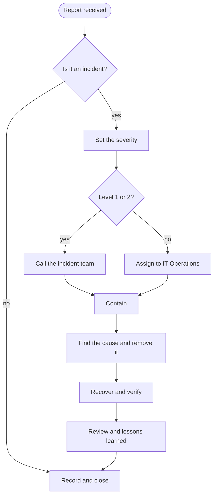

# Incident Response Procedure

This procedure says what to do when something has gone wrong with the
security of information or systems, or looks as if it has. It belongs to the
*Information Security Policy*.

## 1. What counts as an incident

An incident is any event that harms, or could harm, the confidentiality,
integrity or availability of information. For example:

- a laptop or phone is lost or stolen;
- a password has been typed into a page that was not what it seemed;
- a system behaves in a way nobody can explain;
- information was sent to the wrong person.

If you are not sure, report it. A report that turns out to be nothing costs
a few minutes.

## 2. Severity

The incident lead sets the severity, and may change it as more is known.

| Level | Name | Definition | First response | Example |
| :---: | --- | --- | --- | --- |
| 1 | Critical | Restricted information exposed, or a core service down | 15 minutes, any hour | Ransomware on a file server |
| 2 | High | Confidential information exposed, or a service degraded | 1 hour, any hour | Customer list sent to the wrong address |
| 3 | Medium | Limited effect, no sensitive information involved | 4 working hours | Malware caught on one laptop |
| 4 | Low | A weakness or a near miss | Next working day | Door to the server room left open |

## 3. The process



### 3.1 Report

Anyone who notices an incident reports it at once:

1. Call the service desk on extension **4400**, or write to
   `security@example.com`.
2. Say what you saw, when, and on which system or device.
3. Do not try to fix it yourself, and do not switch the device off unless
   you are told to.

   > [!WARNING]
   > Switching a computer off can destroy the traces that show what happened.

### 3.2 Contain

The aim is to stop the harm from spreading, not yet to repair it.

1. Disconnect affected devices from the network.
2. Disable accounts that may have been taken over.
3. Preserve evidence before anything is cleaned:

   ```sh
   # Take a memory image and a disk image, and record their checksums
   sudo avml /evidence/$(hostname)-memory.lime
   sudo dd if=/dev/sda of=/evidence/$(hostname)-disk.img bs=4M status=progress
   sha256sum /evidence/$(hostname)-* > /evidence/$(hostname).sha256
   ```

4. Write down every action in the incident log, with the time and who did it.

### 3.3 Remove the cause and recover

1. Find how the incident started. Removing the symptom without the cause
   invites it back.
2. Rebuild affected systems from a known good state.
3. Restore data from backups taken before the incident began.
4. Watch the recovered systems closely for two weeks.

### 3.4 Review

Within ten working days of closing a Level 1 or Level 2 incident, the
incident lead holds a review. Its questions are always the same:

- [ ] What happened, in order?
- [ ] How was it noticed, and could it have been noticed sooner?
- [ ] What worked in the response, and what did not?
- [ ] What will be changed, by whom, and by when?

## 4. Who to tell

| Who | When | By whom |
| --- | --- | --- |
| Managing Director | Every Level 1 incident, at once | Incident lead |
| Data protection authority | Personal data involved: within 72 hours[^gdpr] | Data Protection Officer |
| National cybersecurity authority | Significant incidents: early warning within 24 hours[^nis2] | Chief Information Security Officer |
| Affected customers | As the contract requires | Account manager, with Legal |

## 5. Contacts

| Role | Name | Phone |
| --- | --- | --- |
| Incident lead (primary) | A. Kovács | +36 1 555 0101 |
| Incident lead (deputy) | B. Nagy | +36 1 555 0102 |
| IT Operations on call | (rota) | +36 1 555 0199 |
| Data Protection Officer | C. Szabó | +36 1 555 0110 |

[^gdpr]: Article 33 of the General Data Protection Regulation.
[^nis2]: Article 23 of Directive (EU) 2022/2555, the NIS2 Directive.
