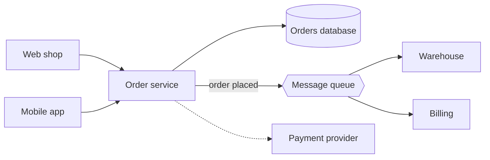
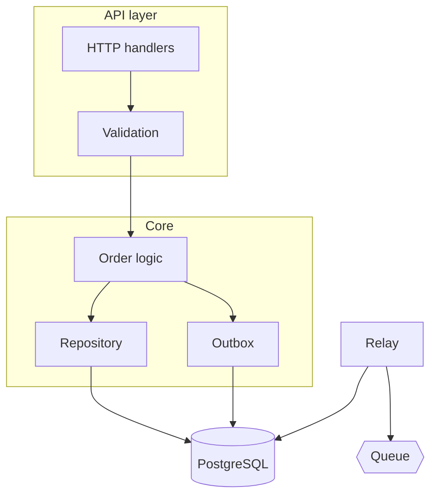

# Order Service Architecture

[TOC]

This document describes the order service: what it is for, how it is built,
and why it is built that way. It follows the outline of arc42, shortened to
the sections this system needs.

## 1. Goals

The order service accepts orders from the web shop and the mobile app,
checks them, and hands them to the warehouse. Three qualities matter most:

| Priority | Quality | What it means here |
| :---: | --- | --- |
| 1 | Reliability | An accepted order is never lost, even if the service is restarted |
| 2 | Latency | 95% of orders are confirmed in under 300 ms |
| 3 | Changeability | A new payment method can be added without touching order logic |

## 2. Context

The service sits between the channels customers order through and the systems
that fulfil the order.



| Neighbor | Direction | Protocol | Notes |
| --- | --- | --- | --- |
| Web shop, mobile app | in | HTTPS, JSON | Authenticated with a short-lived token |
| Payment provider | out | HTTPS | The only call the service waits for |
| Warehouse, billing | out | Messages | Delivered at least once; consumers must cope with repeats |

## 3. Building blocks



HTTP handlers
: Translate requests into commands. No business rules live here.

Order logic
: Checks stock and prices, reserves the payment, and decides whether the
  order is accepted.

Outbox
: A table in the same database as the orders. A message to the queue is
  first written here, in the transaction that stores the order.

Relay
: Reads the outbox and publishes its rows to the queue, marking each as sent.

## 4. A request, step by step

1. The handler checks the token and the shape of the request.
2. The order logic asks the payment provider to reserve the amount.
3. In one database transaction:
   - the order is stored;
   - a row saying "order placed" is written to the outbox.

   ```sql
   BEGIN;
   INSERT INTO orders (id, customer_id, total, status)
        VALUES ($1, $2, $3, 'accepted');
   INSERT INTO outbox (id, topic, payload)
        VALUES ($4, 'order.placed', $5);
   COMMIT;
   ```

4. The handler answers `201 Created`.
5. Within a second the relay publishes the message, and the warehouse starts
   picking.

> [!NOTE]
> If the service stops between steps 3 and 5, nothing is lost: the row is in
> the outbox, and the relay publishes it when the service is back.

## 5. Decisions

### 5.1 An outbox instead of publishing directly

**Context.** Storing an order and publishing a message are two actions. If
the second fails after the first succeeds, the warehouse never hears of the
order.

**Decision.** Messages are written to an outbox table in the order's own
transaction, and published from there.

**Consequences.** An order and its message succeed or fail together. The
price is a delay of up to a second, and consumers that must tolerate a
message arriving twice.

### 5.2 PostgreSQL for orders

Orders need transactions and are queried in ways that are not known in
advance. A relational database gives both; the expected volume (about
40 orders a second at peak) is far below what one instance handles.

## 6. Configuration

```yaml
server:
  port: 8080
  read_timeout: 5s
database:
  url: postgres://orders@db.internal:5432/orders
  max_connections: 20
payment:
  endpoint: https://pay.example.com/v2
  timeout: 2s      # an order is refused rather than kept waiting
relay:
  interval: 500ms
  batch_size: 100
```

## 7. Risks

| Risk | Effect | Mitigation |
| --- | --- | --- |
| Payment provider is slow | Orders time out | A 2 s limit; the shop offers to retry |
| Outbox grows faster than the relay empties it | Messages are late | An alert when the oldest unsent row is older than 30 s |
| A consumer cannot handle repeats | An order is shipped twice | Every message has an id; consumers record the ids they have handled |

## Glossary

Idempotent
: An operation that has the same effect whether it is done once or several
  times.

Outbox
: A table of messages waiting to be published; see [section 3](#3-building-blocks).
