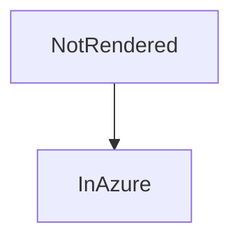

# Azure DevOps

[[_TOC_]]

[[_TOSP_]]

## Diagram

::: mermaid
sequenceDiagram
    A->>B: Hello
:::

## Math

Inline $a + b = c$ and a block:

$$
\int_0^1 x\,dx
$$

## Sized image

## Rest

Use <u>underline</u> via HTML, :smile: emoji and task lists:

- [x] Plan
- [ ] Ship

