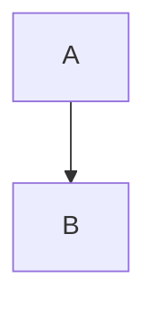

# GitHub (GFM)

Task lists, ~~strikethrough~~, autolinks (https://github.com) and emoji :rocket: :+1:.

- [x] Done
- [ ] Open

| Feature | Supported |
| :------ | :-------: |
| Tables  | yes       |

> [!WARNING]
> Alerts use the five GitHub types.
> They have no custom titles.

Inline math $E = mc^2$ and $`a^2 + b^2`$, color chips `#0969DA` and `rgb(9, 105, 218)`.

```math
\sum_{i=1}^{n} i
```



Water is H<sub>2</sub>O, press <kbd>Ctrl</kbd>, <ins>inserted</ins> text.

<details>
<summary>Collapsed section</summary>

Hidden content.

</details>

A footnote[^1].

[^1]: The note.
