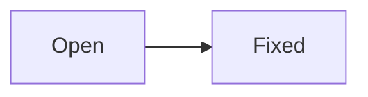

# YouTrack

Checklists, ~~strikethrough~~ and tables follow CommonMark with extensions.

* [x] Reproduced
* [ ] Fixed

| Field    | Value |
|----------|-------|
| Priority | Major |

{width=300}

```latex
\frac{a}{b} = c
```



```stacktrace
java.lang.NullPointerException
	at com.example.Main.main(Main.java:5)
```

No alerts here:

> [!NOTE]
> Just a quote in YouTrack.

No math either: $x$ stays text, and :smile: stays text.
