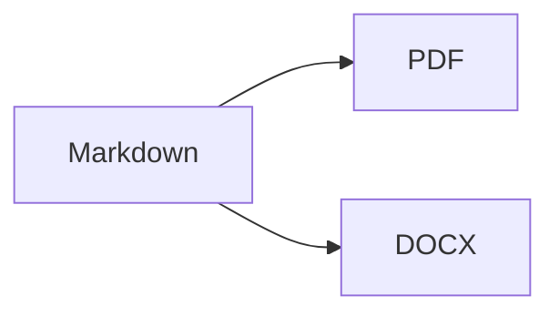

# markout showcase

This document contains every kind of element markout can render, each with a
short note saying what you should see. Convert it to PDF and to DOCX and read
through the result: if every note is true, the output is fine.

```sh
markout fixtures/showcase.md showcase.pdf
markout fixtures/showcase.md showcase.docx
```

Above this heading there should be a panel listing the title, author and date.

## 1. Headings

The six heading levels follow, each smaller than the one before.

# Heading level 1

## Heading level 2

### Heading level 3

#### Heading level 4

##### Heading level 5

###### Heading level 6

## 2. Text formatting

Each word in quotes should look the way it describes itself: "**bold**",
"*italic*", "***bold italic***", "`inline code`" (monospace, colored),
"~~struck through~~" (with a line through it), "<u>underlined</u>",
"==highlighted==" (on a colored background).

Water is H<sub>2</sub>O (the 2 sits below the line) and Einstein wrote
E = mc<sup>2</sup> (the 2 sits above it).

A paragraph long enough to wrap should fill the line and continue on the next
one without any word being cut in half or running past the right margin, which
this sentence is here to demonstrate by simply being long.

Escaped characters appear without their backslash: \*not italic\*, \# not a
heading, \[not a link\]. A copyright sign from an entity: &copy;.

## 3. Links

A [link with text](https://example.com) and a bare address,
https://example.com/bare, should both be colored and clickable.

## 4. Lists

Three bullets, the second with two nested ones:

- First item
- Second item, with **bold** and `code` inside it
  - Nested item one
  - Nested item two
- Third item, long enough to wrap onto a second line so that you can check the
  continuation line starts under the first one and not at the page margin

Three numbered items:

1. First
2. Second
3. Third

A task list, the first box checked and the second empty:

- [x] Done
- [ ] Still to do

Two numbered steps that hold more than a line of text. Under the first, a code
block and then a second paragraph; under the second, a small table and a
quote. All of it is indented to the text of its step, and the second step is
numbered 2:

1. Run the command:

   ```sh
   markout notes.md notes.pdf
   ```

   The file is written next to the source.

2. Check the result:

   | Format | Opens in |
   | ------ | -------- |
   | PDF    | any viewer |

   > Quoted inside a step.

## 5. Tables

A table with a shaded header row, borders, and the numbers in the third column
right-aligned. The last row has formatting and a long cell that wraps.

| Element | Example | Count |
| :------ | :------ | ----: |
| Plain | text | 1 |
| Formatted | **bold**, *italic*, `code` | 22 |
| Long | A cell with enough text that it has to wrap onto more than one line inside its column | 333 |

## 6. Code

A code block in a monospace font on a shaded panel, with its indentation
preserved. It names its language, so the keywords, the function names and the
text in quotes each have a color of their own:

```go
func main() {
	if ok := convert(); !ok {
		fmt.Println("failed")
	}
}
```

## 7. Quotes

A quote, set off from the text by a bar on the left:

> The first paragraph of the quote, with *emphasis*.
>
> The second paragraph of the quote.

## 8. Callouts

Five boxes with a colored bar and title: blue note, green tip, purple
important, amber caution, red warning.

> [!NOTE]
> Something worth knowing.

> [!TIP]
> A helpful hint, with **bold** and `code`.

> [!IMPORTANT]
> Something you must not miss.

> [!CAUTION]
> Take care with this.

> [!WARNING]
> This can go wrong. The text of this callout is long enough to wrap, and the
> box should grow to contain all of it.

## 9. Rule

A horizontal line across the page follows.

---

## 10. Math

Formulas are shown as their LaTeX source in a distinct color, not typeset.
Inline: $E = mc^2$ and \(a^2 + b^2 = c^2\). On a line of its own, centered:

$$
\int_0^1 x^2 \, dx = \frac{1}{3}
$$

## 11. Diagram

Diagram source is shown in a labeled panel, not drawn:



## 12. Definition list

A bold term with its definition indented below it:

Markdown
: A plain-text format for writing structured documents.

Flavor
: A dialect of Markdown, such as the one GitHub uses.

## 13. Images

An image that does not exist shows a placeholder with its description and
path instead of a picture:


## 14. Inline diff and color chips

An addition is {+ green and underlined +}, a removal is {- red and struck
through -}. A color code such as `#2563EB` is preceded by a small square of
that color.

## 15. Emoji

Emoji shortcodes become emoji in DOCX: :rocket: :tada:. In PDF they are left
out, because the built-in fonts have no emoji.

## 16. Footnotes

This sentence has a footnote[^first], and this one has another[^second]. The
numbers should be colored, and both notes should appear at the end of the
document under a short line.

[^first]: The first footnote, with **bold** text.
[^second]: The second footnote.
