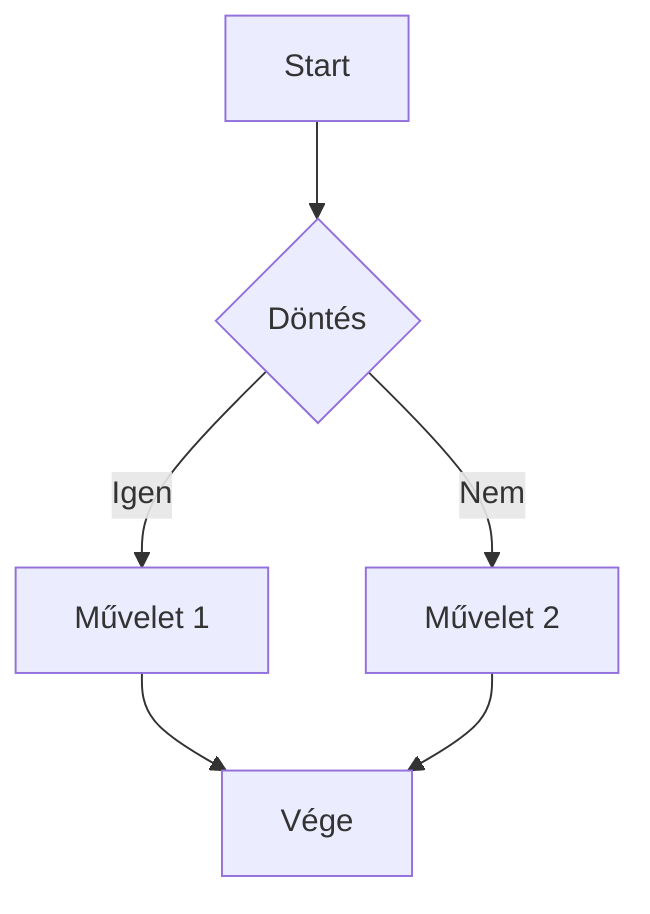
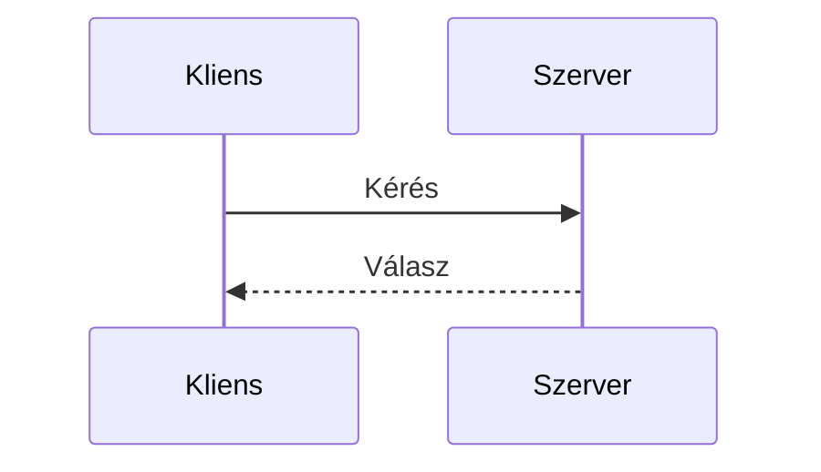

# GitHub Flavored Markdown (GFM) - Teljes Referencia

Ez a dokumentum a GFM összes elemét bemutatja példákkal.

---

## 1. Fejlécek (Headings)

# H1 - Legnagyobb fejléc
## H2 - Másodlagos fejléc
### H3 - Harmadlagos fejléc
#### H4 - Negyedszintű fejléc
##### H5 - Ötödszintű fejléc
###### H6 - Legkisebb fejléc

Alternatív szintaxis H1 és H2 esetén:

Alternatív H1
=============

Alternatív H2
-------------

---

## 2. Szövegformázás (Text Formatting)

**Félkövér szöveg** vagy __így is félkövér__

*Dőlt szöveg* vagy _így is dőlt_

***Félkövér és dőlt*** vagy ___így is___

~~Áthúzott szöveg~~ (GFM specifikus)

Ez egy `inline kód` a szövegben.

---

## 3. Listák (Lists)

### Felsorolás (Unordered List)

- Első elem
- Második elem
    - Beágyazott elem
    - Még egy beágyazott
        - Harmadik szint
- Harmadik elem

Alternatív jelölők:

* Csillaggal
+ Plusszal

### Számozott lista (Ordered List)

1. Első lépés
2. Második lépés
    1. Allépés A
    2. Allépés B
3. Harmadik lépés

A számok nem számítanak, automatikusan számozódik:

1. Első
1. Második
1. Harmadik

### Feladatlista / Checkbox (Task List) - GFM specifikus

- [x] Befejezett feladat
- [x] Ez is kész
- [ ] Még nem kész
- [ ] Ez sincs kész
    - [ ] Beágyazott feladat
    - [x] Beágyazott kész feladat

---

## 4. Linkek (Links)

### Inline link

[Látható szöveg](https://example.com)

[Link címmel](https://example.com "Ez a title, hover-nél látszik")

### Automatikus linkek (Autolinks) - GFM specifikus

Egyszerűen beírt URL: https://github.com

Email automatikus link: info@example.com

### Referencia stílusú linkek

[Ez egy referencia link][ref1]

[Ez is referencia][ref2]

[ref1]: https://example.com
[ref2]: https://example.com/masik "Opcionális title"

### Relatív linkek

[Másik fájl](./masik-fajl.md)

[Képek mappa](./images/)

---

## 5. Képek (Images)

### Inline kép


### Referencia stílusú kép

![Logo][logo]

[logo]: https://via.placeholder.com/200x50 "Logo title"

### Kép linkként

[](https://example.com)

---

## 6. Kódblokkok (Code Blocks)

### Inline kód

Használd a `console.log()` függvényt debugoláshoz.

### Behúzással (4 szóköz vagy 1 tab)

    function hello() {
        console.log("Hello");
    }

### Kerített kódblokk (Fenced Code Block) - GFM specifikus

```
Nincs nyelvjelölés
Egyszerű szöveg
```

### Szintaxis kiemelés nyelvjelöléssel

```javascript
function greet(name) {
    return `Hello, ${name}!`;
}

const result = greet("Világ");
console.log(result);
```

```python
def greet(name):
    """Üdvözlő függvény"""
    return f"Hello, {name}!"

if __name__ == "__main__":
    print(greet("Világ"))
```

```sql
SELECT 
    u.name,
    COUNT(o.id) as order_count
FROM users u
LEFT JOIN orders o ON u.id = o.user_id
WHERE u.created_at > '2024-01-01'
GROUP BY u.id
HAVING order_count > 5
ORDER BY order_count DESC;
```

```bash
#!/bin/bash
echo "Hello World"
for i in {1..5}; do
    echo "Iteration $i"
done
```

```json
{
  "name": "projekt",
  "version": "1.0.0",
  "dependencies": {
    "docx": "^9.0.0"
  }
}
```

```pascal
procedure TForm1.Button1Click(Sender: TObject);
begin
  ShowMessage('Hello Delphi!');
end;
```

---

## 7. Táblázatok (Tables) - GFM specifikus

### Alapvető táblázat

| Fejléc 1 | Fejléc 2 | Fejléc 3 |
|----------|----------|----------|
| Cella 1  | Cella 2  | Cella 3  |
| Cella 4  | Cella 5  | Cella 6  |

### Igazítás

| Balra | Középre | Jobbra |
|:------|:-------:|-------:|
| bal   | közép   | jobb   |
| szöveg| szöveg  | 123    |
| hosszabb szöveg | rövid | 45678 |

### Formázás táblázatban

| Funkció | Szintaxis | Eredmény |
|---------|-----------|----------|
| Félkövér | `**szöveg**` | **szöveg** |
| Dőlt | `*szöveg*` | *szöveg* |
| Kód | `` `kód` `` | `kód` |
| Link | `[szöveg](url)` | [szöveg](url) |

---

## 8. Idézetek (Blockquotes)

> Ez egy idézet.
> Több sorban is folytatható.

> Idézet több bekezdéssel.
>
> Második bekezdés az idézetben.

> Beágyazott idézet:
>
> > Ez egy beágyazott idézet.
> > Még egy sor.
>
> Vissza az első szintre.

> **Formázott idézet**
>
> - Lista az idézetben
> - Második elem
>
> `Kód is lehet benne`

---

## 9. Vízszintes vonal (Horizontal Rule)

Három féle módon:

---

***

___

---

## 10. Escape karakterek (Escaping)

Speciális karakterek megjelenítése backslash-sel:

\*Ez nem lesz dőlt\*

\# Ez nem lesz fejléc

\[Ez nem lesz link\](url)

Backslash: \\

Backtick: \`

Pipe táblázatban: \|

---

## 11. HTML támogatás

GFM támogatja a nyers HTML-t:

<details>
<summary>Kattints a részletekért (összecsukható)</summary>

Ez a tartalom rejtve van alapból.

- Lista a details-ben
- Második elem

</details>

<kbd>Ctrl</kbd> + <kbd>C</kbd> - másolás

H<sub>2</sub>O - alsó index

E = mc<sup>2</sup> - felső index

<mark>Kiemelt szöveg</mark>

<br>

Sortörés HTML-lel fent.

---

## 12. Lábjegyzetek (Footnotes) - GFM kiterjesztés

Ez egy szöveg lábjegyzettel[^1].

Még egy lábjegyzet[^2] és egy nevesített[^megjegyzes].

[^1]: Ez az első lábjegyzet tartalma.
[^2]: Ez a második lábjegyzet.
[^megjegyzes]: A lábjegyzeteknek lehet beszédes neve is.

---

## 13. Definíciós lista - Egyes implementációkban

Kifejezés
: Definíció itt

Másik kifejezés
: Első definíció
: Második definíció

---

## 14. Emoji - GFM specifikus

:smile: :heart: :thumbsup: :rocket: :warning:

:hungary: :computer: :book: :bulb: :fire:

Unicode emoji is működik: 😀 ❤️ 👍 🚀 ⚠️

---

## 15. Megemlítések és hivatkozások - GitHub specifikus

### Felhasználó megemlítése
@username (GitHubon működik)

### Issue/PR hivatkozás
#123 (Issue vagy Pull Request száma)

### Commit hivatkozás
SHA: a]5c3d2e1f (rövidített commit hash)

### Repository hivatkozás
owner/repo#123

---

## 16. Matematikai képletek - GFM kiterjesztés

Inline matek: $E = mc^2$

Blokk matek:

$$
\sum_{i=1}^{n} x_i = x_1 + x_2 + \cdots + x_n
$$

$$
f(x) = \int_{-\infty}^{\infty} e^{-x^2} dx = \sqrt{\pi}
$$

---

## 17. Mermaid diagramok - GFM kiterjesztés





---

## 18. Sortörések (Line Breaks)

Egyszerű sortörés (két szóköz a sor végén):  
Ez új sorban van.

Vagy üres sorral:

Ez egy új bekezdés.

HTML sortörés: első sor<br>második sor

---

## 19. Speciális linkek

### Anchor linkek (dokumentumon belüli)

[Ugrás a táblázatokhoz](#7-táblázatok-tables---gfm-specifikus)

[Vissza az elejére](#github-flavored-markdown-gfm---teljes-referencia)

### Mailto link

[Küldj emailt](mailto:info@example.com)

### Tel link

[Hívj fel](tel:+36301234567)

---

## 20. Összefoglaló táblázat

| Elem | Alap MD | GFM | Megjegyzés |
|------|:-------:|:---:|------------|
| Fejlécek | ✅ | ✅ | H1-H6 |
| Félkövér/Dőlt | ✅ | ✅ | `**` és `*` |
| Áthúzás | ❌ | ✅ | `~~szöveg~~` |
| Listák | ✅ | ✅ | `-`, `*`, `+`, `1.` |
| Tasklist | ❌ | ✅ | `- [x]` |
| Linkek | ✅ | ✅ | `[](url)` |
| Autolink | ❌ | ✅ | URL automatikus |
| Képek | ✅ | ✅ | `` |
| Kódblokk | ✅ | ✅ | ``` vagy behúzás |
| Szintaxis highlight | ❌ | ✅ | ```nyelv |
| Táblázatok | ❌ | ✅ | Pipe szintaxis |
| Idézetek | ✅ | ✅ | `>` |
| HR vonal | ✅ | ✅ | `---` |
| HTML | ✅ | ✅ | Részleges |
| Lábjegyzet | ❌ | ✅ | `[^1]` |
| Emoji | ❌ | ✅ | `:emoji:` |
| Matek | ❌ | ✅ | `$` és `$$` |
| Mermaid | ❌ | ✅ | ```mermaid |

---

*Ez a dokumentum a GFM specifikáció alapján készült.*
*Forrás: https://github.github.com/gfm/*