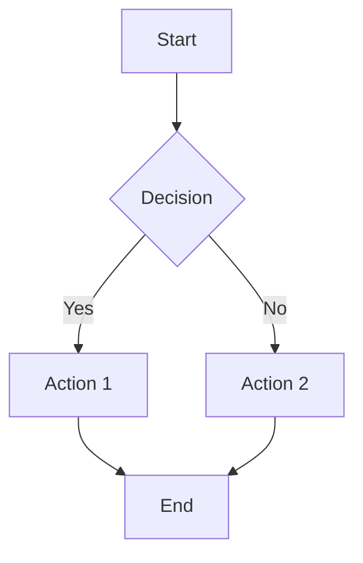
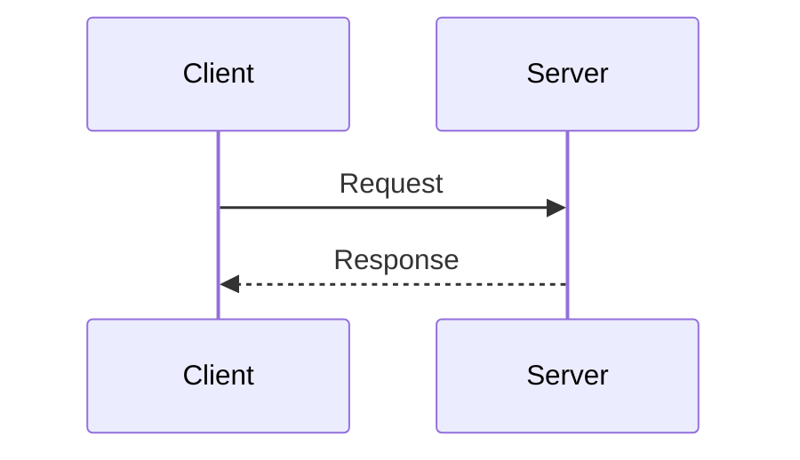

# GitLab Flavored Markdown Features

This document demonstrates all GitLab-specific Markdown extensions supported by Markout.

[[_TOC_]]

---

## 1. Alerts / Callouts

> [!NOTE]
> This is a note callout. Use it to highlight information that users should take into account.

> [!TIP]
> This is a tip callout. Use it to provide helpful advice or shortcuts.

> [!IMPORTANT]
> This is an important callout. Use it to highlight crucial information.

> [!CAUTION]
> This is a caution callout. Use it to advise users to be careful.

> [!WARNING]
> This is a warning callout. Use it to highlight dangerous or destructive actions.

Regular blockquotes still work as expected:

> This is a normal blockquote.
> It should render as before.

---

## 2. Mermaid Diagrams





---

## 3. Color Chips

Inline color swatches for hex color codes:

- Red: `#FF0000`
- Green: `#00FF00`
- Blue: `#0000FF`
- Short form: `#F00`
- With alpha: `#FF000080`
- Coral: `#FF7F50`
- Teal: `#008080`

Regular inline code is unaffected: `console.log("hello")`

---

## 4. Description Lists

HTTP Methods
: GET - Retrieve a resource
: POST - Create a new resource
: PUT - Update an existing resource

Status Codes
: 200 - OK
: 404 - Not Found
: 500 - Internal Server Error

Markdown
: A lightweight markup language for creating formatted text

---

## 5. Math (LaTeX)

### Inline Math

The quadratic formula is $x = \frac{-b \pm \sqrt{b^2 - 4ac}}{2a}$ and Euler's identity is $e^{i\pi} + 1 = 0$.

### Block Math

$$
\sum_{i=1}^{n} x_i = x_1 + x_2 + \cdots + x_n
$$

```math
f(x) = \int_{-\infty}^{\infty} e^{-x^2} dx = \sqrt{\pi}
```

---

## 6. Table of Contents

The `[[_TOC_]]` marker above generates a table of contents from all headings in the document. This is a GitLab-specific feature commonly used in wiki pages and documentation.

---

## 7. Front Matter

The YAML front matter at the top of this document (between `---` delimiters) is parsed and rendered as a styled metadata block. It supports standard fields like `title`, `author`, and `date`, plus arbitrary custom fields.

---

## Mixed Content Test

This section tests that all features work alongside standard Markdown:

### Tables Still Work

| Feature | Status |
|---------|--------|
| Alerts | Supported |
| Mermaid | Supported |
| Color Chips | Supported |
| Description Lists | Supported |
| Math | Supported |
| TOC | Supported |
| Front Matter | Supported |

### Lists Still Work

1. First item
2. Second item
   - Nested bullet
   - Another nested bullet
3. Third item

### Task Lists Still Work

- [x] Implement alerts
- [x] Implement mermaid
- [x] Implement color chips
- [x] Implement description lists
- [x] Implement math
- [x] Implement TOC
- [x] Implement front matter

---

*This document was generated to test GitLab Flavored Markdown support in Markout.*
